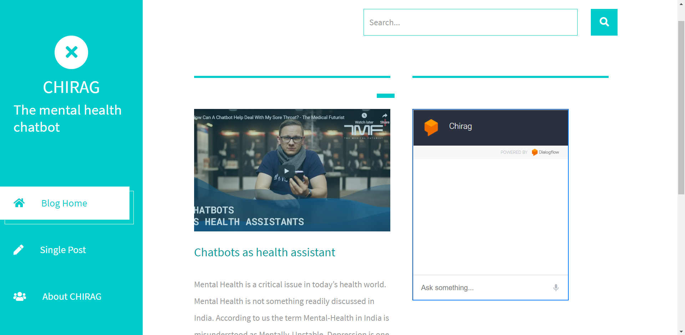
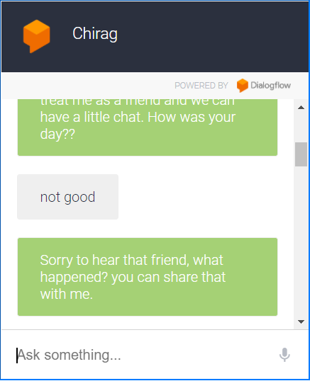

# Chirag
Mental Health Chatbot
Mental Health is a critical issue in today’s health world. Mental Health is not something readily discussed in India. According to us the term Mental-Health in India is misunderstood as Mentally-Unstable. Depression is one of the most neglected problems in India. The only cure for depression and anxiousness is that we get to talk to people who can motivate us. Thus we have come up with an Idea of a Mental Health Chatbot that can be used for curing Depression.

<a href="https://abx9801.github.io/Chirag/">Website Link<a>

##### Status : Project is still in development stage 
- The website is just a prototype

## Website

## Working Chatbot

